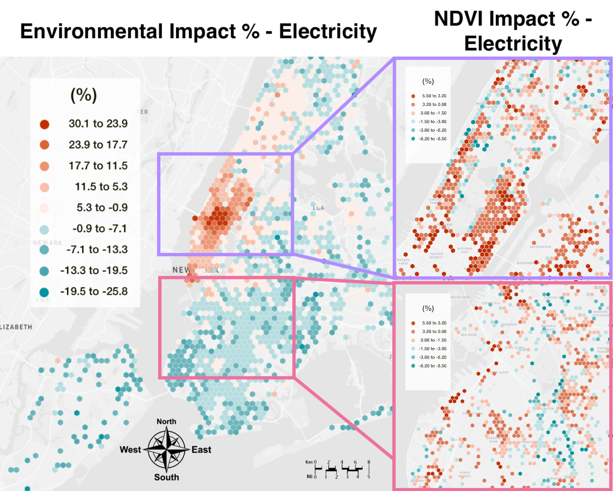

# Invisble Walls
[]
Companion data for reproduction of the paper __Invisible Walls: Exploration of Microclimate Effects on Building Energy Consumption in New York City__. 

 

This work utilizes a new data collection pipeline provided by prior work  to highlight a small case study of microclimate effects in New York City between 2018 and 2021. The full data required to rebuild this research (around 2GB) is hosted through Stanford library's research data deposit and can be found HERE.

Data computed at intermediate steps is included, such that if you are only interested in rebuilding the final figures and results you may do this using the `3c_feature_selection.R` file. We recommend using an editor like R studio to help manage dependencies and configure the path to the current working directory of this repository.

To examine how the data was split and cleaned, you may instead explore the two jupyter notebooks: `2d_missing.ipynb` and `3a_datasplit.ipynb`. Additional to the paper you may find completeness counts for each dataset and its temporal coverage of each building found in the directory `2d`.

The collection process itself was computed by using `data/footprints.geojson` as an input into the [our data collection pipeline](https://github.com/trdougherty/thermal), between the dates of January 2018 and January 2021.

